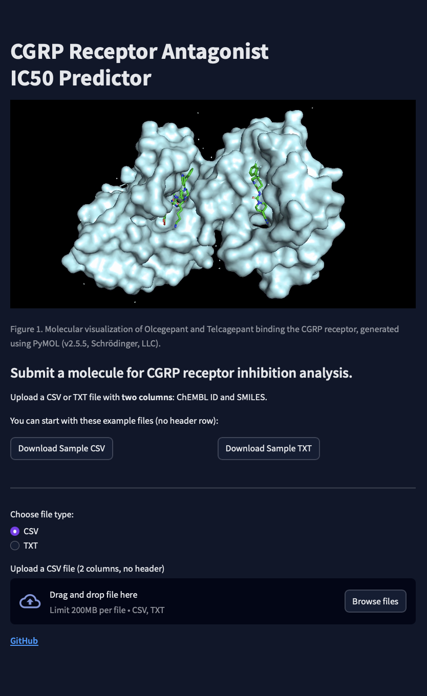

# CGRP Inhibitory Drug Discovery for the Treatment of Migraine


*Screenshot of the Streamlit-based CGRP IC50 prediction interface.*

## Live Link to Streamlit App
https://cgrp-ic50-predictor.streamlit.app 

## Background

### About the CGRP Receptor
The Calcitonin Gene-Related Peptide (CGRP) receptor has been implicated in migraine pathogenesis through the reinforcement of cerebral neural pathways responsible for pain (Goadsby et al., 2017; Edvinsson, 2018). CGRP is known to play a central role in migraine through its involvement in vasodilation, neurogenic inflammation, and pain transmission (Durham, 2006).
Molecules which are found to bind to the receptor through either competitive or non-competitive inhibition with high affinity are candidates for treatments that prevent the frequency and duration of migraines (Goadsby et al., 2017; Edvinsson et al., 2018). Through inhibition of its target receptor, CGRP is unable to trigger the cascade of events involved in migraine propagation, making it an ideal target for novel therapeutic drugs (Edvinsson et al., 2018).

### Drug Discovery Using Predicted IC50
In this project we use the 50% maximal inhibitory concentration (IC50) as our (predicted) target. IC50 is the amount of drug needed for 50% of all CGRP receptors to be bound or inhibited (Sebaugh, 2011). The lower an IC50 value, the stronger the affinity between the target receptor and drug (Cheng & Prusoff, 1973).
Because IC50 provides a quantitative measure of drug potency, it is widely used in pharmacology and drug discovery to compare candidate compounds (Sebaugh, 2011). In this project, predicted IC50 values are used to prioritize molecules that are more likely to be strong CGRP receptor antagonists for further investigation.

## The Model
This Python application generates predicted IC50 values for the CGRP receptor based on canonical SMILES strings. The model was developed using a random forest regression algorithm and is trained on a total of 538 in vitro samples obtained from the ChEMBL database.
This project aims to produce a model that predicts IC50 values based on molecular structures represented as canonical SMILES strings (Simplified Molecular Input Line Entry System), a standard single-line format for encoding chemical structures (Weininger, 1988). Ordinarily, IC50 values must be measured experimentally in the laboratory; however, this model predicts IC50 as a preliminary step prior to wet-lab testing. In this way, the model can serve as a computational sieve to prioritize the most promising candidate molecules.
This in silico screening approach can significantly reduce the time, cost, and experimental burden of drug discovery by filtering large chemical libraries before expensive and time-consuming laboratory assays are performed (Lavecchia, 2015; Chen et al., 2018).

## Limitations of This Model
The IC50 measurements in this dataset were obtained in vitro; therefore, the model cannot account for a drug’s bioavailability, which refers to its ability to reach the target site in vivo. As a result, this algorithm is best suited as an efficient screening tool for evaluating large batches of molecules for receptor affinity. Any drug candidates with sufficiently low predicted IC50 values would still require extensive clinical testing to evaluate bioavailability, toxicity, and potential side effects. This algorithm does not categorize predicted values into active and inactive compounds based on their IC50, however to get an idea of these values please see [CGRP_Analysis.ipynb](./notebooks/CGRP_Analysis.ipynb) in the notebooks/ directory.

## About the Algorithm
Chemical structures were encoded using 880 binary fingerprint features representing the presence or absence of specific chemical substructures. The dataset was sourced from the ChEMBL database and consisted of 538 in vitro IC50 measurements related to CGRP receptor inhibition.
The data were split into training and testing sets using an 80/20 split. Feature dimensionality was reduced using a variance threshold of $p(1−p)$, where $p=0.8$, resulting in 133 retained features. The final training set consisted of 430 samples.
Multiple tree-based models were evaluated and produced similar RMSE and R² values. A random forest regressor was selected for the final model due to its increased stochasticity, which helps mitigate overfitting. Target values were continuous and represented as negative log molarity (pIC50).
For additional details on feature selection and hyperparameter tuning, see [CGRP_model_hypertuning.ipynb](./notebooks/CGRP_model_hypertuning.ipynb) in the notebooks/ directory.

## Intended Use
This application is intended for research and exploratory analysis purposes only. It is designed to support early-stage virtual screening of small molecules for potential CGRP receptor affinity based on predicted IC50 values. Model outputs should not be interpreted as clinical or therapeutic recommendations and must be validated through experimental and clinical testing.


## Quick Start

1. Clone the repository:
  git clone https://github.com/danigeiger/CGRP_project.git
  cd CGRP_project

2. Install dependencies:
  pip install -r requirements.txt

3. Run the Streamlit app:
  streamlit run app.py

4. Upload a CSV or TXT file with two columns (ChEMBL ID and SMILES), or test the app using the sample input files located in the `sample_data/` directory.


## Directory Layout
```
.
├── .streamlit/
│   └── config.toml
├── app.py                  # Streamlit application
├── models/
│   ├── rf_reg.joblib            # Trained Random Forest model
│   ├── variance_selector.joblib # Feature selector
│   └── target_scaler.joblib     # For target/labels
├── static/
│   └── inhib_CGRP.gif
├── sample_data/
│   ├── example_input.csv
│   └── example_input.txt
├── requirements.txt
├── runtime.txt
├── LICENSE                      # MIT License
└── README.md
```

## License

This project is licensed under the MIT License.


## References
- Cheng, Y., & Prusoff, W. H. (1973). Relationship between the inhibition constant (Ki) and the concentration of inhibitor which causes 50 per cent inhibition (IC50) of an enzymatic reaction. Biochemical Pharmacology, 22(23), 3099–3108.
- Chen, H., Engkvist, O., Wang, Y., Olivecrona, M., & Blaschke, T. (2018). The rise of deep learning in drug discovery. Drug Discovery Today, 23(6), 1241–1250.
- Durham, P. L. (2006). Calcitonin gene-related peptide (CGRP) and migraine. Headache: The Journal of Head and Face Pain, 46(S1), S3–S8.
- Edvinsson, L. (2018). The CGRP pathway in migraine as a viable target for therapies. Headache: The Journal of Head and Face Pain, 58(S1), 33–47.
- Edvinsson, L., Haanes, K. A., Warfvinge, K., & Krause, D. N. (2018). CGRP as the target of new migraine therapies — successful translation from bench to clinic. Nature Reviews Neurology, 14(6), 338–350.
- Goadsby, P. J., Holland, P. R., Martins-Oliveira, M., Hoffmann, J., Schankin, C., & Akerman, S. (2017). Pathophysiology of migraine: A disorder of sensory processing. Physiological Reviews, 97(2), 553–622.
- Lavecchia, A. (2015). Machine-learning approaches in drug discovery: methods and applications. Drug Discovery Today, 20(3), 318–331.
- Sebaugh, J. L. (2011). Guidelines for accurate EC50/IC50 estimation. Pharmaceutical Statistics, 10(2), 128–134.
- Weininger, D. (1988). SMILES, a chemical language and information system. 1. Introduction to methodology and encoding rules. Journal of Chemical Information and Computer Sciences, 28(1), 31–36.
- The ChEMBL Database in 2023: a drug discovery platform spanning multiple bioactivity data types and time periods. Barbara Zdrazil, Eloy Felix, Fiona Hunter, Emma J Manners, James Blackshaw, Sybilla Corbett, Marleen de Veij, Harris Ioannidis, David Mendez Lopez, Juan F Mosquera, Maria Paula Magarinos, Nicolas Bosc, Ricardo Arcila, Tevik Kizilören, Anna Gaulton, A Patrícia Bento, Melissa. F Adasme, Pater Monecke, Gregory A Landrum, Andrew R Leach-Nucleic Acids Res. 2023: gkad1004. doi: 10.1093/nar/gkad1004

